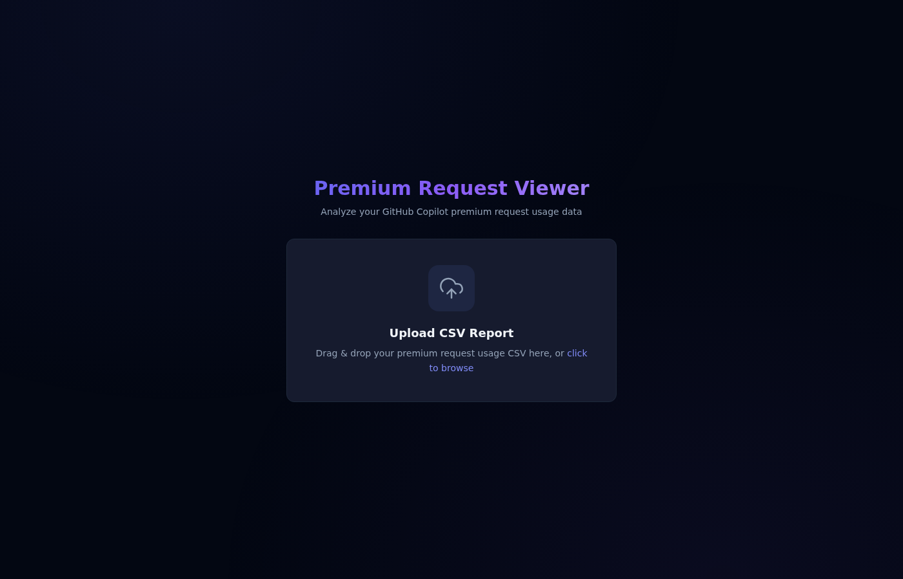
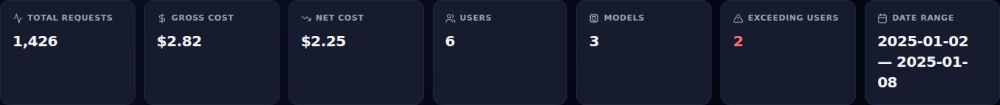
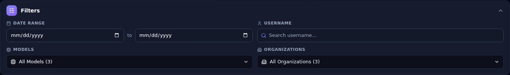
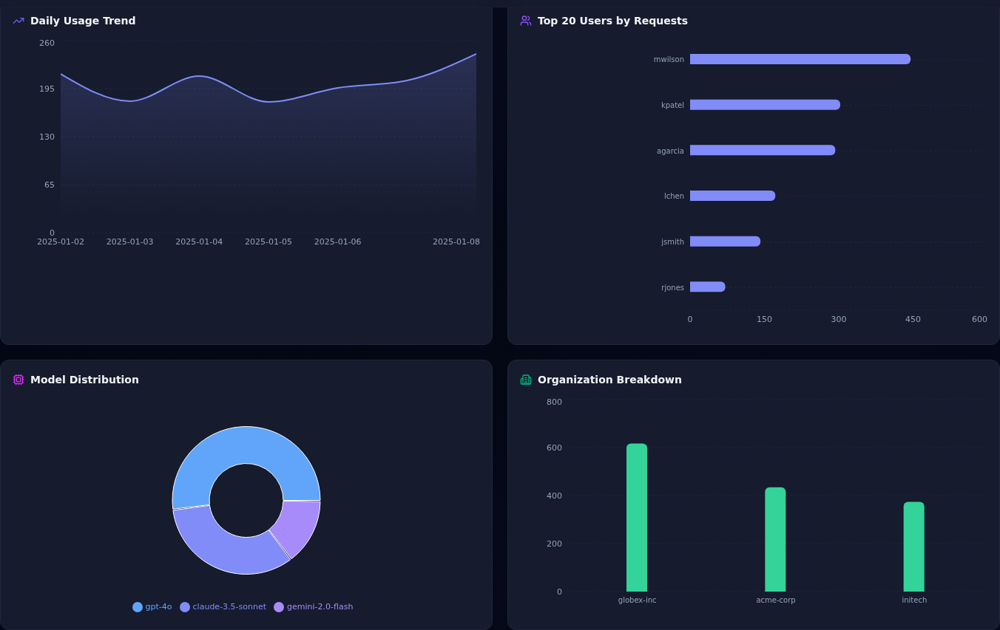
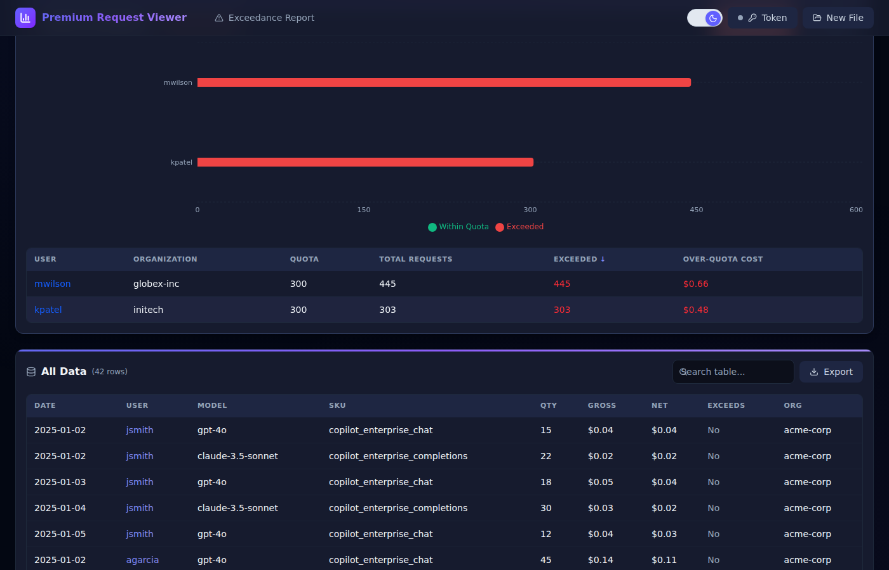
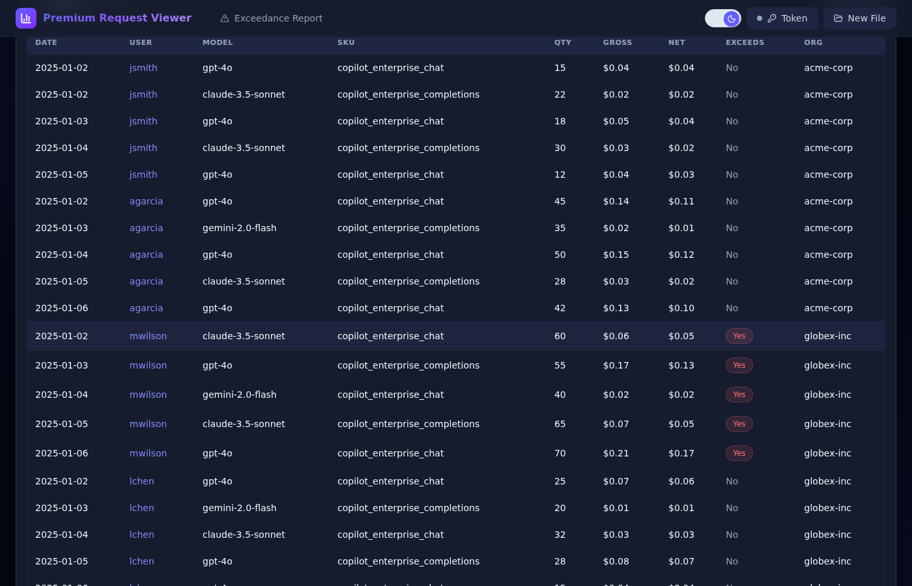
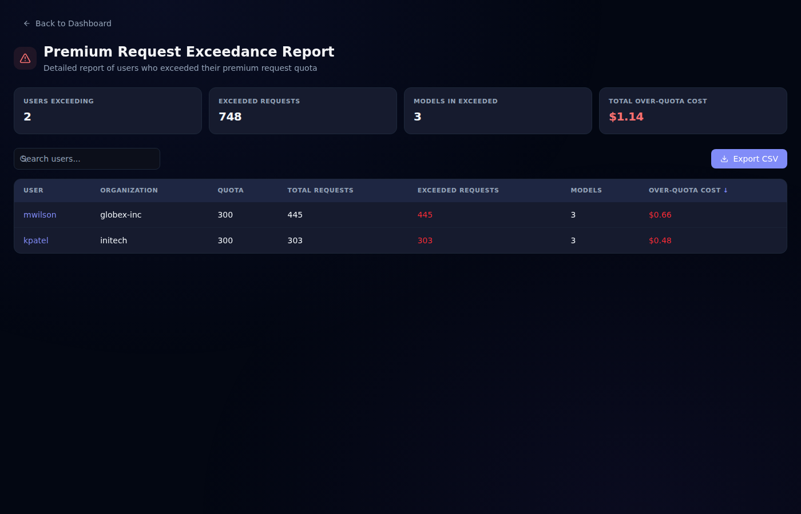
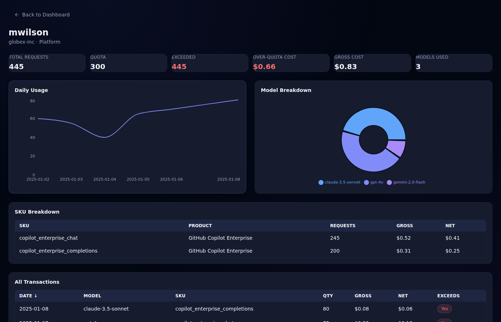

# Premium Request Viewer

[](https://github.com/congiuluc/premium-request-csv-viewer/actions/workflows/deploy.yml)
[](https://congiuluc.github.io/premium-request-csv-viewer/)
[](LICENSE)
[](https://github.com/congiuluc/premium-request-csv-viewer/stargazers)
[](https://github.com/congiuluc/premium-request-csv-viewer/network/members)
[](https://github.com/congiuluc/premium-request-csv-viewer/issues)
[](https://github.com/congiuluc/premium-request-csv-viewer/commits/main)


A modern, dark-themed dashboard for analyzing GitHub Copilot premium request usage data. Upload a CSV report to explore KPIs, interactive charts, and drill into per-user or quota-exceedance details — all client-side with data stored in `sessionStorage`.

## 🚀 Live App

**[https://congiuluc.github.io/premium-request-csv-viewer/](https://congiuluc.github.io/premium-request-csv-viewer/)**

No installation required — open the link, upload your CSV, and start exploring your data instantly.

## 📖 User Manual

For detailed step-by-step instructions, see the **[User Manual](docs/user-manual.md)**.

## 📥 How to Get Your CSV

The app expects a **premium request usage report** exported from GitHub. Follow these steps:

1. **Navigate to Billing** — go to your organization or enterprise page, then click **Billing & Licensing** in the sidebar (organization) or top tab (enterprise).
2. **Open Premium Request Analytics** — under the **Usage** section, click **Premium request analytics**.
3. **Request the report** — at the top of the page, click **Get usage report**.
4. **Specify report details** — choose your desired date range and any other options.
5. **Send the report** — click **Email me the report**. GitHub will send a download link to your primary email address (the link expires after 24 hours).
6. **Download and upload** — download the CSV from the email, then drag-and-drop or select it in this app.

> 📄 For full details see the official GitHub docs: [Downloading usage reports](https://docs.github.com/en/billing/how-tos/products/view-productlicense-use#downloading-usage-reports)

The report CSV will contain the following columns:

`date`, `username`, `product`, `sku`, `model`, `quantity`, `unit_type`, `applied_cost_per_quantity`, `gross_amount`, `discount_amount`, `net_amount`, `exceeds_quota`, `total_monthly_quota`, `organization`, `cost_center_name`

## Screenshots

> All screenshots below use dummy data for demonstration purposes.

### CSV Upload

Drag-and-drop or file picker with animated upload zone; parsed with PapaParse.



### KPI Cards

Color-accented cards displaying total requests, gross/net costs, unique users & models, exceeding users, and date range.



### Enhanced Filtering

Filter by date range, username, and multiple selections for models and organizations with "Select All" capabilities.



### Interactive Charts

Daily trend (area chart with gradient fill), top users (horizontal bar), model distribution (donut pie), and org breakdown (vertical bar).



### Quota Exceedance

Stacked bar chart highlighting users who exceeded their premium request quota with cost breakdown.



### Data Table

Full transaction table with inline search, column sorting, pagination with chevron navigation, and CSV export.



### Exceedance Report

Dedicated page listing users who exceeded quota with cost breakdown and KPI summary.



### User Detail

Per-user view with daily usage chart, model breakdown, SKU table, and full transaction list.



## Features

- **CSV Upload** — drag-and-drop or file picker with animated upload zone; parsed with PapaParse
- **KPI Cards** — color-accented cards displaying total requests, gross/net costs, unique users & models, exceeding users, and date range
- **Interactive Charts** — daily trend (area chart with gradient fill), top users (horizontal bar), model distribution (donut pie), org breakdown (vertical bar), quota exceedance (stacked bar)
- **Data Table** — full transaction table with inline search, column sorting, pagination with chevron navigation, and CSV export
- **Quota Exceedance Report** — dedicated page listing users who exceeded quota with cost breakdown and KPI summary
- **User Detail** — per-user view with daily usage chart, model breakdown, SKU table, and full transaction list
- **GitHub Profile Resolution** — optional: resolve GitHub usernames to real names and avatars via Personal Access Token
- **Dark-First Theming** — dark mode by default; built on Tailwind v4 with a custom design system using semantic CSS variables, glass effects, gradient accents, and smooth animations (fade-in, scale-in, slide-down)
- **Enhanced Filtering** — filter by date range, username, date, and multiple selections for models and organizations with "Select All" capabilities
- **Responsive Layout** — sticky header with backdrop blur, mobile-friendly grid layouts, and smooth transitions

## Installation

```bash
npm install
```

## Usage

```bash
# Development
npm run dev

# Production build
npm run build

# Preview production build
npm run preview
```

Open the app and upload a CSV file exported from GitHub (see [How to Get Your CSV](#-how-to-get-your-csv) above).

## Deployment

The repository includes a GitHub Actions workflow (`.github/workflows/deploy.yml`) that builds and deploys to GitHub Pages on every push to `main`.

Enable GitHub Pages in your repository settings → **Pages** → Source: **GitHub Actions**.

## Tech Stack

- React 19 + TypeScript
- Vite 6
- Tailwind CSS v4 (custom design system with CSS variables)
- Recharts 2
- TanStack React Table v8
- Lucide React (icons)
- PapaParse
- React Router v7 (HashRouter)

## License

MIT
